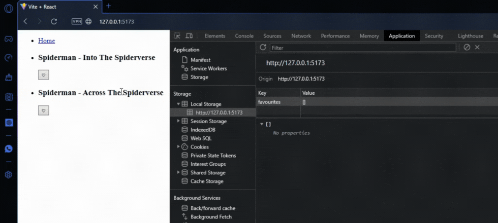

# Favourite Movies - React Hooks

This mini project is an interactive web application that allows users to explore a list of movies and select their favorites. The application utilizes ReactJS and demonstrates the use of useState, useEffect, and a custom Hook called useFavourites in a movie favorites selection application.

### Prerequisites

To use this application, you need to have knowledge of:

+ Node.js - Runtime environment for JavaScript.
+ ReactJS - JavaScript library for building interactive and reactive user interfaces.

### Installing and Running the Project

To download this project, run the following command down below.

```
git clone https://github.com/JuanPablo70/MoviesReact.git
```

Once the project is downloaded, open it in your favorite code editor such as VSCode and execute the following commands in the terminal:

```
npm install

npm run dev
```

In a web browser, visit the link [MoviesReact](http://127.0.0.1:5173/) to view the project.

### Project Functionality



By clicking on one of the favorite buttons, the movie will be selected as a favorite and saved in the local storage. Therefore, even if the page is reloaded, the last selections made will continue to be displayed, maintaining the user's preference state.

### Build With

+ [Vite](https://vitejs.dev) - Next Generation Frontend Tooling
+ [React](https://es.react.dev) - The library for web and native user interfaces

### Version

1.0